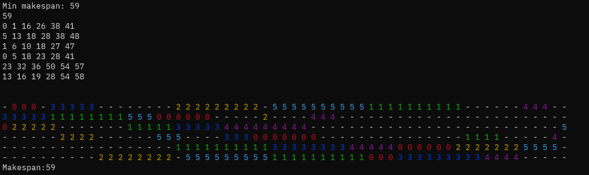

# Job Shop Scheduling Solver

[](https://github.com/your-repo)

## Description

This project is a **Job Shop Scheduling Problem (JSSP) solver** implemented in C++. The JSSP is a classic optimization problem in operations research, where the goal is to schedule a set of jobs on a set of machines, minimizing the total completion time (makespan). Each job consists of a sequence of operations, each of which must be processed on a specific machine for a specified duration.

## Problem Statement

Given:
- A set of jobs, each with a sequence of operations.
- Each operation requires a specific machine for a specific duration.
- Each machine can process only one operation at a time.
- The order of operations for each job must be preserved.

**Objective:**  
Minimize the makespan (the total time required to complete all jobs).

**Benchmark instances:**  
You can find standard JSSP instances at:  
[http://mistic.heig-vd.ch/taillard/problemes.dir/ordonnancement.dir/ordonnancement.html](http://mistic.heig-vd.ch/taillard/problemes.dir/ordonnancement.dir/ordonnancement.html)

## Solution Approach

This solver uses a **Genetic Algorithm (GA)** to find near-optimal solutions for the JSSP:

- **Population Initialization:** Random schedules are generated as the initial population.
- **Selection:** Tournament selection is used to choose parents based on makespan.
- **Crossover:** Children are generated by combining parent schedules.
- **Mutation:** With a certain probability, random changes are introduced to promote diversity.
- **Survivor Selection:** The best individuals are kept for the next generation.
- **Termination:** The algorithm runs for a user-specified time.

## Technologies Used

- C++17

## How to Build and Run

### Prerequisites

- g++ (C++17 or newer)

### Build

In the project directory, run:
```sh
g++ -o main.o ./*.cpp
```

### Run

```sh
./main.o <instance_file> <instance_type> <execution_time>
```
- `<instance_file>`: Path to the instance file (e.g., `instances/ft06.txt`)
- `<instance_type>`: `t` for Taillard format, `b` for Beasley format
- `<execution_time>`: Time in seconds to run the algorithm (e.g., `10`)

**Example:**
```sh
./main.o instances/ft06.txt b 10
```

## Example Output

Below is an example output for the Beasley `ft06` instance:



The output shows the start times for each job (solution) and a visual representation of the schedule, along with the makespan.

## License

This project is licensed under the [MIT License](LICENSE).
